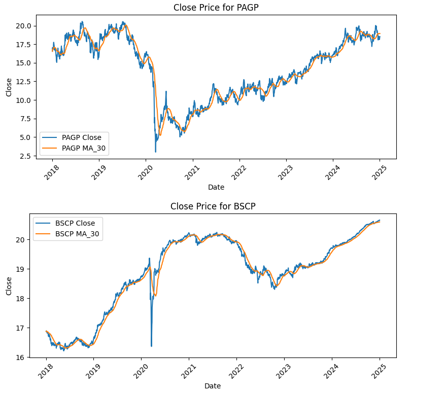

# finance
a repo for finance analysis code

## Environment setup

## Download Data and Generate a Dataframe

### Download The Data

Download data from yfinance by running `download_ticker_data.py`.  

```
usage: download_ticker_data.py [-h] [--csv CSV] [--output OUTPUT] [--start START] [--end END] [--threads THREADS] [--delay DELAY]
                               [--retries RETRIES] [--retry-delay RETRY_DELAY] [--subsample SUBSAMPLE] [--seed SEED]

Download historical stock data using yfinance.

options:
  -h, --help            show this help message and exit
  --csv CSV             Path to the CSV file containing stock symbols (default: nasdaq_symbols.csv).
  --output OUTPUT       Directory to save JSON files (default: stock_data_json).
  --start START         Start date for historical data in YYYY-MM-DD format (default: 2020-01-01).
  --end END             End date for historical data in YYYY-MM-DD format (default: 2023-01-01).
  --threads THREADS     Number of parallel threads for downloading (default: 5).
  --delay DELAY         Delay between downloads in seconds to prevent rate limiting (default: 0.1).
  --retries RETRIES     Maximum number of retries for failed downloads (default: 3).
  --retry-delay RETRY_DELAY
                        Delay between retries in seconds (default: 5).
  --subsample SUBSAMPLE
                        Download data for subsample fraction of the symbols (0.0 to 1.0).
  --seed SEED           seed passed to library random

```


For example:

```
cd src
python download_ticker_data.py --csv ../data/nasdaq_symbols.csv --output ../data/stock_data_json/ --start 2020-01-01 --end 2025-01-03 --subsample 0.1
```

This utility parses a list of symbols in a CSV file and downloads a json file per symbol and stores it in the location provided in the `--output` argument.  You must provide a start and an end date as well.  For quick tests you can utilize the `--subsample` parameter to download a specified fraction of the data.  After the command runs then there should be a set of json files, one per symbol, in the output directory.

Note that the utility will warn and show errors in `download.log`.  The errors **will not** appear on the console.

### Create A Dataframe

Next you can create a dataframe from the downloaded json files by running `create_dataframe.py`.

```
usage: create_dataframe.py [-h] [--directory DIRECTORY] [--ma_windows MA_WINDOWS [MA_WINDOWS ...]] [--drop_cols [DROP_COLS ...]]
                           --outputpkl OUTPUTPKL

Process JSON stock data by filling missing dates and computing moving averages.

options:
  -h, --help            show this help message and exit
  --directory DIRECTORY
                        Path to the directory containing JSON files.
  --ma_windows MA_WINDOWS [MA_WINDOWS ...]
                        List of integers specifying moving average windows.
  --drop_cols [DROP_COLS ...]
                        List of column names to drop from the final DataFrame.
  --outputpkl OUTPUTPKL
                        pathname to write out dataframe to (in pickle format)

```

For example:

```
python create_dataframe.py --directory ../data/stock_data_json/ --outputpkl dataframe.pkl
```

This command will load each json file found in `../data/stock_data_json` into a dataframe, and will combine all the individual dataframes into a combined dataframe.  Some date filtering is implemented.  When we request data from yfinance, it gives us whatever it has,  even if it doesn't fill the requested time span provided when `download_ticker_data.py` was called.  As a result a bunch of the json files will have partial data stored in them that won't cover the dates we specified.  A min/max date filter is implemented such that any dataframe which doesn't cover the min/max time of all the dataframes is dropped.  This is a fairly harsh filter but it does guarantee that we will only use complete datasets. After the dataframes are filtered, the specified moving average columns are added to each dataframe.  Finally the combined dataframe is written out to the location specified by `--outputpkl`.

### Plot Some Data

You can plot some data by running the notebook called `plot_stock_data.ipynb`.

The stock data should look something like this:


